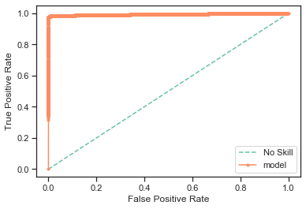

# Homework 2
### Group: Luke/William/Kossi

# Part 1: Decision Tree  

We used GridSearchCV to find the optimal parameters for our DecisionTreeClassifier. Providing an array of options for criterion and maxDepth, we let the GridSearchCV algorithm determine the optimal parameters. While GridSearchCV was able to provide us optimal parameters for our training dataset, we knew this didn't necessarily mean it would fit our test dataset as well as there was still a risk of overfitting and so we then tested our model againt the test dataset, going back an forth a bit in order to determine the best maxDepth parameter. We settled on parameters of 'entropy' and a maxDepth of 12. When looking at how our model performed against the test dataset the results were quite good.

Here are the metrics that were captured:
**accuracy:** 0.997
**recall:** 0.989
**precision:** 0.998
**f-measure:** 0.993

Confusion Matrix:


ROC Curve


To determine the optimal set of features from the dataset we used the RFECV algorithm with the decision tree classifer. We started with all the features (including 'grade' and 'int_rate') and then let the algorithm determine the features for us. We did this mostly as an exeriment to see if we'd see if grade and int_rate would be some of the features chosen.

Our results were as follows:


As you can see, the cross validation scores only goes down after increasing the number of features.

As far as what features were selected, here were the resulting rankings (top 10):
feature|score
-------|-----
recoveries          | 1
funded_amnt         | 1
emp_length::9 years | 1
total_pymnt         | 1
emp_length::8 years | 2
emp_length::7 years | 3
emp_length::6 years | 4
emp_length::5 years | 5
emp_length::4 years | 6
dti                 | 7

What was somewhat surprising here was the neither 'grade' nor 'int_rate' were selected as optimal features. Which perhaps lends some evidence the models used by LendingClub are not as accurate and there isn't as strong correlation between int_rate and grade.

So, using the top four features, we created a new feature set, and attempted to find the optimal parameters using GridSearchCV again.

This time our GridSearchCV settled on parameters of 'entropy' and a maxDepth of 11. The resulting metrics are performed against our test data is as follows:
**accuracy:** 0.996
**recall:** 0.982
**precision:** 0.999
**f-measure:** 0.991

Confusion Matrix:


ROC Curve


The results here when compared are actually quite similar. The model with the full feature set gives slightly more accurate results, but given that the number of features dropped from 65 to 4, the second model is preferred in our opinion because of sheer simplicity.

# Part 2: Logistic Regression

We again used GridSearchCV to find the optimal parameters for our Logistic Regression model.
Providing an array of options for penalty, and solver. We left the C float value to be 0.1 as we didn't have a lot of intuition as to what this value might do and decided to leave it at the smaller value of 0.1 in order to get a stronger regularization. 

As for the penalty and solver parameters, this time we settled on parameters:

```
{'C': 0.1, 'penalty': 'l1', 'solver': 'liblinear'} 
```

When looking at how our model performed against the test dataset the results were also quite good:

**accuracy:** 0.993
**recall:** 0.969
**precision:** 0.998
**f-measure:** 0.984

Confusion Matrix:


ROC Curve


Using the set of features that was determined from Part1 i.e. ['loan_amnt', 'funded_amnt', 'recoveries', 'total_pymnt'], we proceed to build a logistical regression model using these features. We first used GridSearchCV to determine optimal parameters. This time the optimal parameters where the same:

```
{'C': 0.1, 'penalty': 'l1', 'solver': 'liblinear'} 
```

When looking at how our this model performed against the test dataset the results were also quite good:

**accuracy:** 0.990
**recall:** 0.953
**precision:** 1.000
**f-measure:** 0.976

Confusion Matrix:


ROC Curve



Comparing the Logistic Regression models vs Decision Tree Model we can see that the results are actually quite similar.

# Part 3: Model Investigation

In order to evaluate if grade and interest rate were possibly calucated values and if they have effect on 

### Using Grade feature

Using just the Grade feature we were able to produce following model with the following metrics:

best validation score  0.6784488096884151 

**accuracy:** 0.790
**recall:** 0.058
**precision:** 0.512
**f-measure:** 0.104

ROC Curve


### Using Int Rate feature

best validation score  0.6873421936329331 

Using just the Grade and Int Rate features we were able to produce following model with the following metrics:

**accuracy:** 0.788
**recall:** 0.079
**precision:** 0.483
**f-measure:** 0.136

ROC Curve


### Using Grade and Int Rate features

Using just the Grade and Int Rate features we were able to produce following model with the following metrics:

best validation score  0.6870006415282901 


**accuracy:** 0.790
**recall:** 0.038
**precision:** 0.517
**f-measure:** 0.070

ROC Curve


