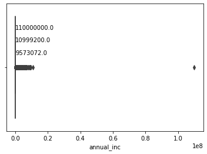
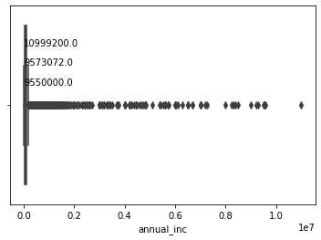

### Part 1:

#### 1. Fundamentally, what decisions will Jasmine need to make? 

Jasmine will need to decide how much to invest in LendingClub, and how much money to allocate for other options in the investment. After deciding how much to invest in LendingClub, she will then need to decide the amount of loan to invest.

#### 2. What is Jasmine's objective when making these decisions? 

She will have to decide on the objective that would help her make as much money as possible. How will she use the data to help her in deciding which loan to invest to see the best return.
 
#### 3. How will she be able to distinguish 'better' decisions from 'worse' ones? 

Jasmine will make a better decision from taking a look at the actual outcome of the loans and finding how much returns she would get from the investment.

#### 4. Why would Jasmine even think past data might be helpful and how could she use past data to help make her decisions? 

Jasmine should look at past data to get insights into the types of loans that are being sold through LendingClub. By looking at past data, she could hopefully identify how future loans might pan out so that she can make a more educated decision when purchasing loans. When looking at past data, gather data to answer some of the following questions might help her make better decisions:
- Which types of loans might be paid earlier that the life of the loan?
- How soon would that early payment be?
- Which loan is likely to default?
- How fast would the default happen?

#### 5. Take a brief look at the data and the data dictionary, paying attention to the description of the attributes that describe the loans. How would you categorize these attributes? 

The attributes include things such as lender employment status, job title, annual income, loan interest rates, and total loan payment. There are several ways to categorize this data but the first step Jasmine might take would be to seperate categorical and numeric variables. For example, employment status or job title should be thought of as a categorical variable while annual income or FICO would be numerical attributes. From here, numerical values can be further categorized by unit. For example, there are several attributes pertaining to ratios (percentage), dollars, number of months/years, and dates.
   
#### 6. Which attributes do you think are the most important to an investor like Jasmine? 
 
Investors like Jasmine will be most interested in the return on their investments (either actual return or annualized return). Jasmine could calculate the return by using the data available to her. In Jasmine's case, the relevant variables for calculating the return are the loan status, the total payment, the funded amount, the fees generated, and the loan duration.

#### 7. Looking through the data, you might notice some variables seem related. For example, total_pymnt is likely strongly correlated to the loan status. Why are some variables related? 

Many of these variables are redundant in a sense depending on the configuration of the data. For instance, the `total_pymnt` variable is somewhat redundant if the loan_status is 'Fully Paid' since this value could be inferred by looking at the loan amount. Another instance of this is `zip_code` and `addr_state` as `zip_code` describes `addr_state`. And so much of this data is related because these variables are somewhat describing the same thing (either for convience or because there are edge cases which require them). 

#### 8. Why does this matter and how might you check?

This matters because it means some variables are essentially being counted twice and therefore will 'weigh' more in the resulting model. You could check by creating a regression model of these variables and looking for a correlation or just using your own intuition to determine what this data is telling you and which might be telling you the same thing.

#### 9. It is unclear whether the value for some variables is current as of when the data is downloaded or when the loan was issued. Give an example of such a variable and describe why this matters (in general for all variables).

Many of these variables are unclear on this front and most of them are ones that have to do with information about the borrower. For instance, `delinq_2yrs` is a variable that describes 'The number of 30+ days past-due incidences of delinquency in the borrower's credit file for the past 2 years'. It is unclear if this means the past 2 years from when the data was downloaded or then the load was issued. One could probably safely assume this is from when the loan was issued since it is unlikely that this value is kept up to date for all borrowers. However, this matters because if this is not the case, then a value liek `deling_2yrs` could be a data leak so to speak because it would be representing information we might not have at the time of issueing/grading a loan.

#### 10. How might you check to see if this is indeed correct?

Double check to see what the information was when the loan was issued (i.e. from a previous download time) to see if the values are the same.

### Part 2: 

#### 1. Download the datasets from ICON in the ‘Full Dataset’ folder. How many observations and features are in the full dataset?

There are 1763077 observastions in the full dataset.

#### 2. The '1712_download' and '1912_download' folders on ICON contain datasets downloaded in 2017 and 2019 for the same loans. Compare these two datasets, does anything appear amiss?

It looks as thought the 2017 dataset has a column that 2019 does not. This column is 'disbursement_method'. There are also many static columns (meaning the values in the columns did not change). This makes sense since we are looking at the same loan information. However, what's interesting is that where we see an interest rate change we might also expect to see an installment change (i.e. there was a refinance of the loan). There are some cases where this is not the case (35 rows).

#### 3. Remove all instances representing loans that are still current (those not in status 'Fully Paid', 'Charged-Off', or 'Default') and all loans issued before January 1, 2011 from the full dataset. Discuss the appropriateness of these filtering steps.

Removing these rows is appropriate because we don't know the outcome of these loans yet. We don't want to include data for our model where we don't know if our predicted outcome is correct or not.

#### 4. Visualize all the attributes in the file and turn in one visualization for a continuous variable and one visualization for a discrete variable. Are there any outliers? If yes, remove them and report which observations here.

Discrete Variable Visualization: Grade
|grade|number
|-|-|
|B|234953|
|C|232657|
|A|148542|
|D|110686|
|E|42237|
|F|13604|
|G|5014|

Continuous Variable Visualization: Annual Income

As you can see there is a pretty obvious outlier for annual income where the value is over 100,000,000 dollars.

As far as other outliers within the data set, we also noticed that revol_bal (>1,250,000) and delinq_2yrs (>32) both had some outliers.

After removing annual income outlier:

### Part 3:

#### 1. The most important data we will need in determining the return of each loan is the total payments that were received on each loan. There are two variables related to this information: total pymnt and recoveries. Investigate these two variables, and for each loan, determine the total payment made on each loan. Does the total pymnt variable include those recoveries, or do they need to be added on? Briefly describe how you came to your conclusion.

So it looks like the recoveries column included the recoveries payments as well. We have made this conclusion based on the fact that when looking at a calculation of the installments times the length of the loan, we can see that this total always comes short of the total_pymnt value.

#### 2. A key measure we will need in working out an investment strategy is the return on each loan, defaulted or otherwise. Add these four new variables to the data. What is the mean and median return for each of the four return variables?

- Method 1 Pesimistic results:
	- Mean: 0.0415733204919579
	- Median: 2.7863924675738607
- Method 2 Optimisic results:
    - Mean: 4.9245445703291955
	- Median: 7.476474863868679
- Method 3 (1.2%)
	- Mean: 13.209380349514971
	- Median: 17.644040016278385
- Method 3 (3%)
	- Mean: 46.793771973857005
	- Median: 49.54462031819411

#### 3. LendingClub assigns a grade to each loan, from A through G. Use the dataset to answer the following questions:

##### a. How many loans are in each grade?

| |percentage|count   |
|-|----------|--------|
|A|18.878608 |146737.0|
|B|29.852586 |232034.0|
|C|29.5450988|229644.0|
|D|14.000484 |108821.0|
|E|5.363158  |41686.0 |
|F|1.727337  |13426.0 |
|G|0.632731  |4918.0  |

##### b. What is the default rate in each grade?
| |default_rate|
|-|------------|
|A|6.688156    |
|B|14.920227   |
|C|24.604170   |
|D|33.379587   |
|E|41.582306   |
|F|50.357515   |
|G|54.005693   |

##### c. What is the average interest rate in each grade?

| |interest_rate|
|-|------------|
|A|6.981119    |
|B|10.477369   |
|C|14.113935   |
|D|18.758675   |
|E|23.610692   |
|F|27.434500   |
|G|29.965842   |

##### d. What is the average percentage (annual) return for each grade using each of the return calculations?

|grade|return_OPT|return_PESS|return_INTa|return_INTb|
|-|-|-|-|-|
|A|3.850003|	1.036243|	13.964298|	44.180124
|B|4.647929|	0.764194|	13.727066|	45.465953	
|C|5.069478|	-0.179073|	13.113111|	47.799174	
|D|5.754727|	-1.230543|	12.113887|	48.077860
|E|6.634144|	-1.741258|	11.986214|	51.456900
|F|6.456103|	-2.456857|	11.371310|	53.871506
|G|6.227061|	-3.346234|	10.381430|	53.216044

##### e. Calculate and describe the skewness and kurtosis for the interest rate attribute and each of the return attributes.

- Interest Rate results
	- Kurtosis: 0.7923193787702627
	- Skewness: 0.9274066932504201
- Method 1 Pesimistic results:
	- Kurtosis: 2.1895256579179883
	- Skewness: -1.7151026655056627
- Method 2 Optimisic results:
	- Kurtosis: 1.1258894162746378
	- Skewness: -1.0197136575455488
- Method 3 (1.2%)
	- Kurtosis: 1.836033439040972
	- Skewness: -1.6591283502486942
- Method 3 results (3%)
	- Kurtosis: 0.24431715900694284
	- Skewness: -0.25928553401635884

##### f. If you had to invest in one grade only, which loans would you invest in and why?

Perhaps grade B because there are a pretty common to find amongst all loans, it returns better results than grade A for Method 1 results and Method 3 (3%) results, and even when looking at the pessimistic results, it only slightly performs worse than Grade A. Also it doesn't average a negative return for pessimistic results which means it is a safer investment.